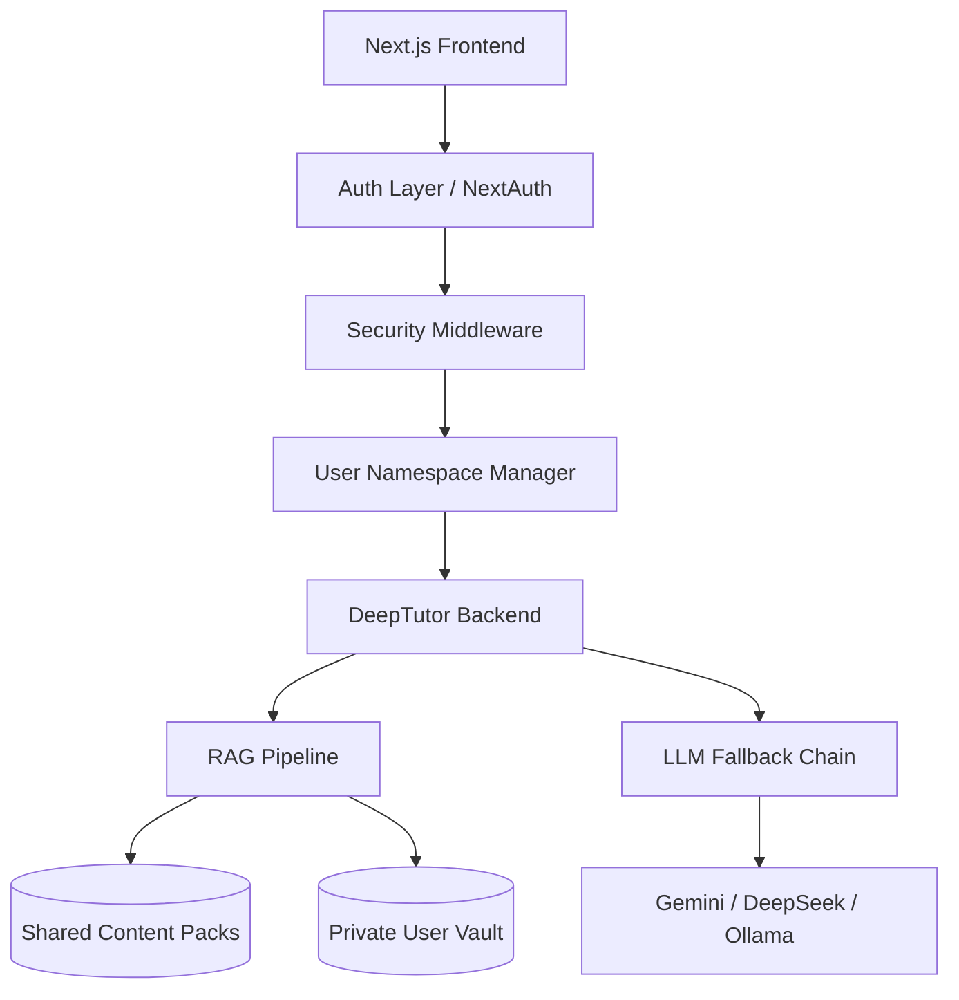

# GS360 — The Open-Source UPSC Command Center

**Democratizing UPSC preparation. Zero-cost AI tutoring. Plug-and-play knowledge. Built for aspirants, by aspirants.**

[-green.svg)](docs/implementation_plan.md)

---

## 🚀 The Vision

In India, UPSC coaching is a multi-crore industry that often prices out the most deserving candidates. **GS360** is the first open-source, agent-native platform designed to break this barrier. We aren't just a notes-app; we are a specialized AI ecosystem that transforms raw study materials into an interactive, cited, and accurate learning experience.

## 🧠 Why GS360?

### 1. Agent-Native Tutoring (Powered by DeepTutor)
Unlike generic LLMs, GS360 uses a custom-patched **DeepTutor engine** with 16k+ lines of agent logic. It doesn't just "chat"; it teaches. It remembers your progress, identifies your weak spots in the syllabus, and provides answers grounded strictly in your provided content.

### 2. Plug-and-Play Content Packs
The "moat" of GS360 is its community. Anyone can create a Content Pack (NCERTs, Laxmikanth summaries, PYQ banks) by simply organizing files into folders. The system auto-ingests these into isolated vector indices, making them queryable in seconds.

### 3. Hardened RAG Accuracy
We treat accuracy as an engineering discipline. Every week, the engine is tested against a **Golden Dataset** of 200+ verified UPSC questions. Our 6-step de-risking strategy ensures zero hallucinations about critical constitutional or factual data.

| Category | Day-1 Target | Week 12 Target |
|---|---|---|
| Factual Recall | 75% | 90% |
| Comprehension | 65% | 80% |
| Analytical | 45% | 65% |

### 4. Security-First Multi-Tenancy
We take student data privacy seriously. GS360 implements:
- **Index Isolation**: Your personal notes and uploads use physically separate vector stores.
- **Path Sanitization**: Mandatory realpath validation to prevent path traversal.
- **Audit Logging**: Request-level authentication bound to your unique workspace.

---

## 🛠️ The Architecture

---

## ⚡ Quickstart

### Infrastructure Requirements
- **Hardware**: 4GB+ RAM for local vector operations.
- **API**: Gemini API Key (Pro/Flash free tier).
- **Runtime**: Python 3.11 + Node.js 20.

### Installation
1.  **Clone**: `git clone https://github.com/JINA-CODE-SYSTEMS/GS360.git`
2.  **Scaffold**: Follow instructions in [CONTRIBUTING.md](CONTRIBUTING.md) to initialize the backend and frontend submodules.
3.  **Run**: `docker-compose up`

---

## 🔌 Content Ecosystem

The platform ships with a "Cold-Start" suite of content packs including:
- **UPSC PYQs (2000–2025)**: ~2,500 questions with AI-verified explanations.
- **NCERT Essentials**: Summaries and MCQs for History, Polity, Geography, and Economy.
- **PIB/Survey/Budget**: Real-time summaries for current affairs.

Learn how to contribute your own packs in the [Content Guide](docs/CONTENT_GUIDE.md).

---

## 📅 Roadmap (16-Week Hardened Plan)

- **Week 1-2**: **Phase 0** — Multi-tenancy security spike & Auth integration.
- **Week 3-6**: **Phase 1** — Core AI suite (Notes, Quizzes, Flashcards) + RAG baseline.
- **Week 7-10**: **Phase 2** — GS360 Design System & Command Center UI.
- **Week 11-13**: **Phase 3** — Content creation & Domain expert review.
- **Week 14-16**: **Phase 4** — Soft launch, Beta feedback, & Public release.

See the full [Implementation Plan](docs/implementation_plan.md) for technical deep-dives.

---

## 🤝 Community & Governance

GS360 is maintained by **Jina Code Systems LLP** under a BDFL model. We prioritize transparency, security, and student success above all else.

- **Conduct**: [CODE_OF_CONDUCT.md](CODE_OF_CONDUCT.md)
- **Governance**: [GOVERNANCE.md](GOVERNANCE.md)
- **Security**: [SECURITY.md](SECURITY.md)

---

## 💰 Funding & Cost
GS360 is **free forever**. We use a tiered scaling model (Free Tier → Bootstrap → Sponsors) to ensure the platform remains accessible even as the community grows to 10k+ users.

---

Built with ❤️ in India by [Jina Code Systems LLP](https://jinacode.systems).
