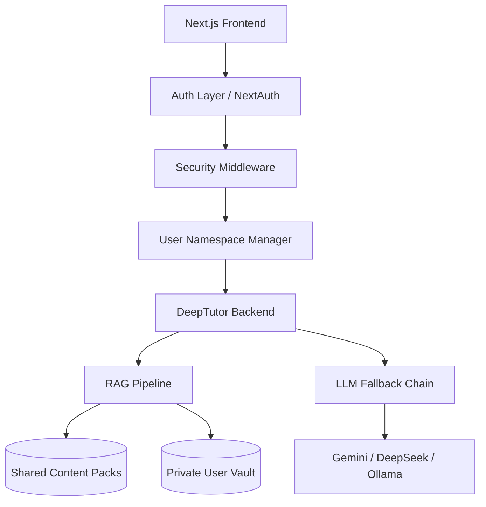

# GS360 — The Open-Source UPSC Command Center

**Democratizing UPSC preparation. Zero-cost AI tutoring. Plug-and-play knowledge. Built for aspirants, by aspirants.**

[](LICENSE)
[](https://github.com/TutorScribe/DeepTutor)
[-green.svg)](docs/implementation_plan.md)

---

## 🚀 The Vision

In India, UPSC coaching is a multi-crore industry that often prices out the most deserving candidates. **GS360** is the first open-source, agent-native platform designed to break this barrier. We aren't just a notes-app; we are a specialized AI ecosystem that transforms raw study materials into an interactive, cited, and accurate learning experience.

## 🧠 Why GS360?

### 1. Agent-Native Tutoring (Powered by DeepTutor)
Unlike generic LLMs, GS360 uses a custom-patched **DeepTutor engine** with 16k+ lines of agent logic. It doesn't just "chat"; it teaches. It remembers your progress, identifies your weak spots in the syllabus, and provides answers grounded strictly in your provided content.

### 2. Plug-and-Play Content Packs
The "moat" of GS360 is its community. Anyone can create a Content Pack (NCERTs, Laxmikanth summaries, PYQ banks) by simply organizing files into folders. The system auto-ingests these into isolated vector indices, making them queryable in seconds.

### 3. Hardened RAG Accuracy
We treat accuracy as an engineering discipline. Every week, the engine is tested against a **Golden Dataset** of 200+ verified UPSC questions. Our 6-step de-risking strategy ensures zero hallucinations about critical constitutional or factual data.

| Category | Day-1 Target | Week 12 Target |
|---|---|---|
| Factual Recall | 75% | 90% |
| Comprehension | 65% | 80% |
| Analytical | 45% | 65% |

### 4. Security-First Multi-Tenancy
We take student data privacy seriously. GS360 implements:
- **Index Isolation**: Your personal notes and uploads use physically separate vector stores.
- **Path Sanitization**: Mandatory realpath validation to prevent path traversal.
- **Audit Logging**: Request-level authentication bound to your unique workspace.

---

## 🛠️ The Architecture



---

## ⚡ Quickstart

### Infrastructure Requirements
- **Hardware**: 4GB+ RAM for local vector operations.
- **Runtime**: Python 3.11+ and Node.js 20+.
- **Package managers**: `pip` and `npm`.
- **Optional**: Docker + Docker Compose for containerized run.

### Installation
1. **Clone**

    ```bash
    git clone https://github.com/JINA-CODE-SYSTEMS/GS360.git
    cd GS360
    ```

2. **Backend dependencies**

    ```bash
    cd gs360-live
    python -m venv .venv
    .venv\Scripts\activate
    pip install -r requirements.txt
    ```

3. **Frontend dependencies**

    ```bash
    cd web
    npm install
    ```

4. **Environment files**
- Create `gs360-live/.env` from `gs360-live/.env.example`
- Create `gs360-live/web/.env.local` and set `NEXT_PUBLIC_API_BASE=http://localhost:8000`

5. **Run (local)**
- Backend (from `gs360-live/backend`):

  ```bash
  python -m uvicorn app.main:app --host 0.0.0.0 --port 8000 --reload
  ```

- Frontend (from `gs360-live/web`):

  ```bash
  npm run dev
  ```

- Open `http://localhost:3000`

### Dev Branch Local Run (Latest)
For active development on `dev`, run the GS360 backend and web app directly:

1. Start backend: `python -m uvicorn app.main:app --host 0.0.0.0 --port 8000 --reload` from `gs360-live/backend`
2. Start frontend: `npm run dev` from `gs360-live/web`
3. Open: `http://localhost:3000`

Notes:
- Frontend API base should target `http://localhost:8000` in `gs360-live/web/.env.local`.
- If you see `Invalid token: Signature verification failed`, clear stale local login state by reloading and logging in again.
- DeepTutor `deep_solve` and `deep_research` can require extra DeepTutor config assets; GS360 dev fallback now keeps these sections functional with direct LLM responses.

### Docker Run
From repo root:

```bash
docker compose up --build
```

Expected ports:
- Frontend: `3000`
- Backend: `8000`

---

## 🔐 Environment Configuration

### Required keys (`gs360-live/.env`)
- `LLM_BINDING=openai`
- `LLM_MODEL=gpt-4o-mini`
- `LLM_API_KEY=<your-key>`
- `LLM_HOST=https://api.openai.com/v1`

### Recommended keys
- `EMBEDDING_API_KEY=<your-key>`
- `GS360_SECRET_KEY=<long-random-secret>`

### Frontend (`gs360-live/web/.env.local`)
- `NEXT_PUBLIC_API_BASE=http://localhost:8000`

Security guidance:
- Never commit `.env` files.
- Rotate keys if exposed in logs/chat history.

---

## 🧩 Current API Surface (Backend)

Core endpoints:
- `GET /health`
- `POST /auth/token`
- `POST /api/chat`
- `POST /api/solve`
- `POST /api/research`
- `POST /api/quiz`
- `GET /api/knowledge`
- `POST /api/knowledge`
- `POST /api/notes`
- `POST /api/eval/live`
- `GET /api/packs`
- `POST /api/guide/generate`

Realtime:
- `WS /ws/chat?token=<jwt>`

---

## 🧪 Troubleshooting

### 1) `Failed to fetch` on login
Cause: frontend points to wrong backend port.

Fix:
- Set `NEXT_PUBLIC_API_BASE=http://localhost:8000` in `gs360-live/web/.env.local`.
- Restart frontend dev server.

### 2) `Invalid token: Signature verification failed`
Cause: stale JWT in browser localStorage after backend secret/key updates.

Fix:
- Refresh page and login again.
- The frontend now auto-clears token on `401` and returns to login.

### 3) Next.js runtime chunk errors (example: `Cannot find module './778.js'`)
Cause: stale `.next` build cache.

Fix:

```bash
cd gs360-live/web
rm -rf .next
npm run dev
```

### 4) `uvicorn` not found
Cause: missing backend dependencies or wrong interpreter.

Fix:
- Activate virtual env and install requirements:

```bash
cd gs360-live
.venv\Scripts\activate
pip install -r requirements.txt
```

### 5) DeepTutor capability-specific config errors (`deep_solve`, `deep_research`)
Cause: missing DeepTutor runtime config assets in local environment.

Current behavior:
- Chat uses DeepTutor turn runtime.
- Solve/Research routes use robust direct-LLM fallback in dev so UI remains usable.

---

## 📁 Repository Layout

- `gs360-live/backend`: FastAPI backend + DeepTutor bridge
- `gs360-live/web`: Next.js frontend
- `gs360-live/core`: shared domain/runtime helpers
- `gs360-live/scripts`: validation, ingest, and evaluation scripts
- `demo-gs360`: standalone demo UI assets
- `docs`: governance/content/plan documents

---

## 🔌 Content Ecosystem

The platform ships with a "Cold-Start" suite of content packs including:
- **UPSC PYQs (2000–2025)**: ~2,500 questions with AI-verified explanations.
- **NCERT Essentials**: Summaries and MCQs for History, Polity, Geography, and Economy.
- **PIB/Survey/Budget**: Real-time summaries for current affairs.

Learn how to contribute your own packs in the [Content Guide](docs/CONTENT_GUIDE.md).

---

## 📅 Roadmap (16-Week Hardened Plan)

- **Week 1-2**: **Phase 0** — Multi-tenancy security spike & Auth integration.
- **Week 3-6**: **Phase 1** — Core AI suite (Notes, Quizzes, Flashcards) + RAG baseline.
- **Week 7-10**: **Phase 2** — GS360 Design System & Command Center UI.
- **Week 11-13**: **Phase 3** — Content creation & Domain expert review.
- **Week 14-16**: **Phase 4** — Soft launch, Beta feedback, & Public release.

See the full [Implementation Plan](docs/implementation_plan.md) for technical deep-dives.

---

## 🤝 Community & Governance

GS360 is maintained by **Jina Code Systems LLP** under a BDFL model. We prioritize transparency, security, and student success above all else.

- **Conduct**: [CODE_OF_CONDUCT.md](CODE_OF_CONDUCT.md)
- **Governance**: [GOVERNANCE.md](GOVERNANCE.md)
- **Security**: [SECURITY.md](SECURITY.md)

---

## 💰 Funding & Cost
GS360 is **free forever**. We use a tiered scaling model (Free Tier → Bootstrap → Sponsors) to ensure the platform remains accessible even as the community grows to 10k+ users.

---

Built with ❤️ in India by [Jina Code Systems LLP](https://jinacode.systems).
