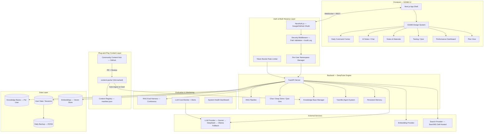

# GS360 × DeepTutor — Final Implementation Plan (v3)

> **Mission:** The first open-source, plug-and-play, AI-powered UPSC learning platform. Built for Desktop & Web. Free forever. Anyone can add content. Anyone can fork it for any exam.
>
> **This plan supersedes all prior versions.** It merges the original architecture, senior developer review (12 points), and all revisions into a single source of truth.

---

## Table of Contents

1. [Why This Will Succeed](#-why-this-will-succeed-as-open-source)
2. [Architecture Overview](#-architecture-overview)
3. [Content Pack System](#-plug-and-play-content-system)
4. [All 20 Gaps — Resolved](#-all-20-gaps--resolved)
5. [All 12 Assumptions — Mitigated](#-all-12-assumptions--mitigated)
6. [All 6 Decisions — Resolved](#-all-6-decisions--resolved)
7. [POC Tests & Eval Harness](#-poc-tests--continuous-eval-harness)
8. [Cold-Start Content Strategy](#-cold-start-content-strategy)
9. [Integration Reality Check](#-integration-reality-check)
10. [Team & Capacity Model](#-team--capacity-model)
11. [16-Week Timeline](#-16-week-timeline)
12. [Post-v1 Roadmap (Phase 5)](#-post-v1-roadmap-phase-5-content-bootstrap--current-affairs-pipeline)
13. [Cost Model](#-honest-cost-model)
14. [Operational Runbook](#-operational-runbook)

---

## 🏆 Why This Will Succeed as Open Source

### The Core Thesis

> **There is no free, AI-powered, open-source UPSC preparation tool. 15 lakh+ aspirants sit for UPSC every year. The market is served by ₹50K–₹2L coaching packages and ₹5K–₹15K app subscriptions. An open-source alternative with AI + community content will spread like wildfire.**

### 8 Structural Advantages

| # | Advantage | Why It Works |
|---|---|---|
| **1** | **Zero-Cost Operation** | Gemini free tier (1,500 req/day) + Vercel free + Supabase free = ₹0/month at <50 users. No VC funding needed. Students trust it because there's no business model to corrupt it. |
| **2** | **200K Lines of Code — Free** | DeepTutor (16.5K stars, Apache-2.0) gives us RAG, quiz generation, TutorBots, memory, CLI, multi-channel agents — all production-tested. We build a UPSC skin, not an AI engine. |
| **3** | **Community Builds The Product** | Content packs = the moat. Every student who adds PYQs, notes, or flashcards makes the platform better for everyone. Wikipedia model for UPSC prep. Community contributes AFTER v1 launches with self-authored seed content. |
| **4** | **Network Effects** | More content → better AI answers → more students → more content contributed → stronger RAG → better quiz generation → cycle accelerates. |
| **5** | **Fork-Ready = Unstoppable** | GATE, SSC, State PSC, NEET — fork, swap content packs, change branding. The engine doesn't care about the exam. |
| **6** | **Self-Hosted = No Lock-In** | Students own their data. No server dependency. No "company shutting down" risk. Open source = permanent. |
| **7** | **India-Specific Timing** | India has the world's largest competitive exam ecosystem (5Cr+ aspirants/year combined). India-specific open-source AI tools are nearly zero. |
| **8** | **No Competitor Can Match Free + Open + AI** | Unacademy (₹10K+/yr), Testbook (₹5K+/yr) — all closed-source, subscription-based, no AI tutoring. Free + AI-native is a different category. |

### Competitive Landscape

| Platform | Price | AI-Powered | Open Source | Offline | Community Content | Self-Hosted |
|---|---|---|---|---|---|---|
| **Unacademy** | ₹10K–₹60K/yr | ❌ | ❌ | ❌ | ❌ | ❌ |
| **Testbook** | ₹5K–₹15K/yr | ❌ Basic | ❌ | ✅ | ❌ | ❌ |
| **BYJU's** | ₹30K–₹1.5L | ❌ | ❌ | ✅ | ❌ | ❌ |
| **Khan Academy** | Free | ❌ | ❌ | ❌ | ❌ | ❌ |
| **Free YouTube/Telegram** | Free | ❌ | N/A | ❌ | ✅ Informal | N/A |
| **GS360 Open Source** | **Free** | **✅ Full AI** | **✅ Yes** | **✅ PWA** | **✅ Plug-and-Play** | **✅ Yes** |

### The Community Flywheel


---

## 📐 Architecture Overview



> [!NOTE]
> **v1 scope exclusions:** Voice Bot (Siri Orb), AI Cowork Studio, and Study Mode Focus Timer are deferred to v1.1. This is a deliberate scope-discipline decision, not technical limitation.

---

## 🔌 Plug-and-Play Content System

### Directory Structure

```
gs360-live/
├── content-packs/                    # ALL content lives here
│   ├── registry.json                 # Master manifest — lists all packs
│   │
│   ├── upsc-polity/                  # One folder = one content pack
│   │   ├── pack.json                 # Pack metadata
│   │   ├── documents/                # Raw source materials (PDF, MD, TXT)
│   │   ├── questions/                # MCQ + Mains question banks (JSON)
│   │   ├── notes/                    # Pre-made study notes (Markdown)
│   │   ├── prompts/                  # TutorBot personas (Markdown)
│   │   ├── flashcards/               # Spaced repetition cards (JSON)
│   │   └── cache/                    # Pre-generated AI outputs (fallback)
│   │
│   ├── upsc-economy/
│   ├── upsc-history/
│   ├── upsc-current-affairs-apr-2026/
│   └── gate-cse/                     # Non-UPSC — fork-ready
│
├── private-vault/                    # User's PRIVATE content (not in Git)
│   ├── uploads/
│   ├── video-transcripts/
│   └── custom-kb/
│
├── eval/                             # Evaluation datasets
│   ├── golden-dataset.json           # 200 UPSC questions with verified answers
│   ├── eval-results/                 # Weekly eval run outputs
│   └── eval-runner.py                # Automated eval script
│
├── templates/                        # Pack creation templates
│   ├── pack-template/
│   └── CONTENT_GUIDE.md
│
└── scripts/
    ├── ingest-packs.py               # Auto-ingest into DeepTutor KBs
    ├── validate-pack.py              # Schema + quality validation
    ├── export-pack.py                # Export KB back to pack format
    └── cost-monitor.py               # LLM usage tracking + alerts
```

### Key Schemas

- **`pack.json`** — Declares metadata, exam target, subject, language, content counts. The ingestion script reads this to route content.
- **`questions/*.json`** — `id`, `year`, `question`, `options[]`, `correct`, `explanation`, `difficulty`, `topics[]`, `source`, `contributor`. Feeds quiz engine + RAG context.
- **`flashcards/*.json`** — `front`, `back`, `difficulty`, `topic` for spaced repetition.

### Contribution Workflow

```
Contributor (no code needed)              Automated Pipeline
─────────────────────────────             ──────────────────
1. Fork repo
2. Copy templates/pack-template/
3. Add PDFs to documents/
4. Add MCQs to questions/*.json
   (or use web form → auto-generates JSON)
5. Edit pack.json metadata
6. Submit PR                              → GitHub Actions triggers:
                                            ✓ validate-pack.py (schema)
                                            ✓ Question format check
                                            ✓ Copyright scan (hash + text fingerprint)
                                            ✓ Duplicate detection (embedding similarity)
                                            ✓ LLM quality scorer
                                          → 2 community reviewers approve
                                          → Auto-merge → Auto-ingest
```

---

## ✅ All 20 Gaps — Resolved

### 🔴 G1: Authentication System

**Solution: Dual-Mode Auth**

| Mode | Auth | Use Case |
|---|---|---|
| **Self-Hosted (Single User)** | `AUTH_MODE=none` — no auth needed. Works like stock DeepTutor. | Student running locally |
| **Hosted / Multi-User** | `AUTH_MODE=multi` — NextAuth.js with Google OAuth, GitHub OAuth, Email magic link (Resend free tier: 3K emails/mo). Session stored in Supabase free tier. | Shared hosted platform |

**Effort:** 1 day. NextAuth.js is drop-in for Next.js. Supabase adapter exists.

---

### 🔴 G2: Multi-Tenancy — Security-Hardened

> [!CAUTION]
> **This is the #1 technical risk.** The `UserNamespace` class is the easy part. The hard part is tracing every hardcoded path assumption across DeepTutor's 16K+ lines. This is debugging work, not codegen. Phase 0 Spike validates feasibility before committing.

**Solution: Per-User Namespace Manager + Security Middleware**

```python
# middleware/namespace.py
class UserNamespace:
    """Routes all DeepTutor file operations to user-specific directories."""

    VALID_USER_ID = re.compile(r'^[a-zA-Z0-9_-]{1,64}$')

    def __init__(self, user_id: str):
        if not self.VALID_USER_ID.match(user_id):
            raise ValueError(f"Invalid user_id: {user_id}")
        self.user_id = user_id
        self.base = os.path.realpath(f"data/users/{user_id}")
        if not self.base.startswith(os.path.realpath("data/users/")):
            raise PermissionError(f"Path traversal attempt: {user_id}")
```

```python
# middleware/security.py
class SecurityMiddleware:
    """Request-level security enforcement. Every API call passes through this."""

    def validate_request(self, request, jwt_claims: dict):
        user_id = jwt_claims["sub"]  # From JWT, NEVER from request body
        namespace = UserNamespace(user_id)
        audit_logger.info(f"ACCESS user={user_id} endpoint={request.path}")
        return namespace

    def validate_file_path(self, namespace, requested_path: str):
        real_path = os.path.realpath(requested_path)
        user_base = os.path.realpath(namespace.base)
        shared_base = os.path.realpath("data/knowledge_bases/")

        if real_path.startswith(user_base) or real_path.startswith(shared_base):
            return True
        audit_logger.warning(f"BLOCKED user={namespace.user_id} path={requested_path}")
        raise PermissionError("Access denied: path outside your namespace")
```

**Data Isolation:**

```
data/
├── knowledge_bases/           # SHARED — content packs (read-only for users)
├── users/                     # ISOLATED — per-user data
│   ├── user_abc123/
│   │   ├── memory/            # Learner profile
│   │   ├── sessions/          # Chat history
│   │   ├── notebooks/         # Saved notes
│   │   └── knowledge_bases/   # Private uploads (physically separate vector index)
│   └── user_def456/
│       └── ...
```

**Security Requirements (Non-Negotiable for v1):**

| Requirement | Implementation |
|---|---|
| Path traversal prevention | `os.path.realpath()` + prefix validation on every file access |
| Index isolation | User private KBs use **physically separate** vector stores, NOT filtered views |
| Request-level auth | `user_id` from JWT `sub` claim, NEVER from request body |
| Audit logging | Every file access logged with `user_id`, path, timestamp |
| WebSocket isolation | Each WS connection authenticated + bound to single user namespace |
| Pre-launch pen test | 10 common attack vectors (path traversal, IDOR, session fixation, KB cross-contamination) |

**Key Design:** Content packs (community knowledge) = shared read-only. User data (notes, scores, memory) = fully isolated with physically separate vector indices. RAG queries merge both at query-time, never at index-time.

**Effort:** 5–7 days realistic.
- 2 days patching DeepTutor's file path resolution
- 2 days for LlamaIndex per-user vector store pooling
- 1–2 days for WebSocket session isolation
- 1 day for security middleware + audit logging

---

### 🔴 G3: Desktop-Optimized Premium UI

**Decision:** Desktop-first. No mobile app. Desktop/web optimized for deep research & note-taking.

```css
.app {
  display: grid;
  grid-template-columns: 240px 1fr; /* Fixed sidebar */
  height: 100vh;
}

@media (max-width: 1024px) {
  .app { grid-template-columns: 80px 1fr; } /* Collapsed sidebar */
}

@media (max-width: 768px) {
  .app { grid-template-columns: 1fr; }
  .sidebar { display: none; } /* Hamburger menu on mobile */
}
```

**Validation:** Post-launch, Plausible analytics tracks device type. If >60% of traffic is mobile after 30 days, reconsider in v1.1 with data, not assumptions.

**Effort:** 1 day.

---

### 🔴 G4: Offline Support (PWA)

**Solution: Progressive Web App + Offline Quiz**

| Feature | Offline? | How |
|---|---|---|
| Quiz (from content packs) | ✅ Full | Question banks cached in IndexedDB |
| Flashcard revision | ✅ Full | Cached locally |
| Read/write notes | ✅ Full | IndexedDB, synced on reconnect |
| Study timer | ✅ Full | Client-side only |
| AI Chat / Notes Gen | ❌ No | Shows "Connect to internet for AI features" |
| Upload materials | ⚠️ Queued | Saved locally, uploaded when online |

**Effort:** 3 days.

---

### 🔴 G5: Rate Limiting + LLM Fallback

**Solution: Token-Bucket Rate Limiter + Multi-Provider Fallback Chain**

```
Request comes in
    ↓
1. Try Gemini Flash 2.0 (free, fast)
    ↓ if rate-limited or down
2. Try DeepSeek V3 ($0.14/M tokens — ultra cheap backup)
    ↓ if rate-limited or down
3. Try Ollama local (if self-hosted with GPU)
    ↓ if unavailable
4. Serve pre-generated cached response (from content pack cache/)
    ↓ if nothing cached
5. Show "AI quota reached — try again in X minutes" + offer offline quiz
```

**Per-user limits (free tier):** 20 AI requests/hour, 100/day, 10 quiz generations/day, 3 deep research/day.

**Effort:** 3 days.

---

### 🔴 G6: Copyright Protection — 3-Layer System

```
Layer 1: Automated Scan (on PR / upload)
─────────────────────────────────────────
• SHA-256 hash check against known copyrighted PDFs
• Filename pattern matching ("Laxmikanth*.pdf", etc.)
• File size threshold (>5MB PDF flagged)
• PDF metadata extraction (author/publisher fields)
• Text fingerprinting — extract 10 random pages, compute n-gram
  signatures against known textbook corpus
• Paragraph-level similarity against reference corpus (~500 paragraphs)

Layer 2: Community Review (on PR)
──────────────────────────────────
• 2 reviewer approvals required
• PR template checklist: original / public domain / PYQ / fair use

Layer 3: DMCA Process (post-publish)
─────────────────────────────────────
• DMCA.md in repo root with takedown instructions
• Email: dmca@gs360.study
• Response SLA: 48 hours
• Auto-remove on valid claim, reinstate on counter-notice
```

> [!NOTE]
> Layer 1 will never be bulletproof — even YouTube can't detect copyright reliably. The 3-layer approach is the industry standard used by GitHub, Wikipedia, and Internet Archive.

**Allowed:** NCERT, UPSC PYQs, Constitution, PIB, Economic Survey, Budget docs, original notes.
**Not allowed:** Full copyrighted textbooks, coaching material, scanned paid test series.

**Effort:** 2 days.

---

### 🔴 G7: Data Backup

**Solution:** Daily automated backup to Cloudflare R2 (free: 10GB, 1M ops/month).

- **Frequency:** Daily at 2:00 AM IST
- **What:** `data/users/` + `data/knowledge_bases/` (content packs already in git)
- **Retention:** 7 daily + 4 weekly snapshots
- **Encryption:** AES-256 at rest
- **User-side:** "Export My Data" button downloads zip with all personal data

**Effort:** Half day.

---

### 🟡 G8: i18n → **Deferred to v1.1**

v1 launches English-only. next-intl framework setup in v1.1. Community translates via same PR process as content packs.

---

### 🟡 G9: Accessibility

Applied during Phase 2 design:
- `aria-label` on all interactive elements
- Keyboard navigation (Tab, Enter)
- `:focus-visible` outlines
- Color contrast ≥ 4.5:1 (WCAG AA)
- Semantic HTML (`<nav>`, `<main>`, `<aside>`)
- `aria-live="polite"` on quiz timer
- Enforced by ESLint `jsx-a11y` plugin

**Effort:** 1 day during design phase.

---

### 🟡 G10: Analytics → **Post-Launch (Week 15)**

Plausible Analytics (self-hosted, free, privacy-respecting). Tracks: page views, content pack usage, quiz completion rates, geography, **device type** (validates desktop-first decision).

Does NOT track: personal identity, study content, AI conversations.

**Effort:** 2 hours.

---

### 🟡 G11: Content Deduplication

Embedding similarity check (>0.92 threshold) during CI before merge. Blocks duplicate questions.

**Effort:** Half day.

---

### 🟡 G12: Syllabus Change Handling

Syllabus version tracked in `registry.json`. Outdated packs flagged. Config-only.

---

### 🟡 G13: Load Testing

k6 script ships with repo. Ramp to 50 concurrent users, hold 5 min. Documented limits: free tier handles ~30–50 concurrent users.

**Effort:** Half day.

---

### 🟡 G14: SEO

Public pages (landing, PYQ database, CA summaries) are SSR via Next.js. Meta tags, structured data, sitemap. Monthly CA packs auto-publish as blog posts.

**Effort:** 1 day.

---

### 🟡 G15: Data Export

Settings → "Export My Data" → zip with `profile.json`, `notes/`, `quiz-history.json`, `flashcard-progress.json`, `sessions/`, `README.md`. Import also supported.

**Effort:** 1 day.

---

### 🟢 G16–G20: Deferred

| Gap | Solution | When |
|---|---|---|
| G16: Real-time collaboration | WebSocket rooms via Partykit | v2 |
| G17: Plagiarism detection | Embedding similarity against answer corpus | v2 |
| G18: Native mobile app | **Non-goal.** Desktop/web only. Validated post-launch. | v2 |
| G19: UPSC model fine-tuning | Fine-tune Qwen2.5-7B on PYQ explanations | v3 |
| G20: Admin panel | `/admin` with moderation queue, user stats | v1.1 |

---

## 📋 All 12 Assumptions — Mitigated

| # | Assumption | Mitigation |
|---|---|---|
| **A1** | DeepTutor stays stable | Pin to v1.0.2. Soft fork (overlay, don't modify core). Apache-2.0 = we can continue independently if they pivot. |
| **A2** | Gemini free tier persists | Multi-provider fallback chain. Worst case: DeepSeek at $0.14/M tokens → ~₹500/month for 10K users. |
| **A3** | Students have internet | PWA with offline quiz, notes, flashcards. Core study flow works offline. |
| **A4** | NCERT is redistributable | Link to official NCERT portal. Extract only summaries + key concepts under fair use. |
| **A5** | Community contributes | Do NOT rely on community for v1 content. Self-author all seed content from public sources. Community contributes AFTER platform has traction. |
| **A6** | Desktop-first is OK | Defensible (Notion, Obsidian, Anki all desktop-first). Validate post-launch with analytics. |
| **A7** | Self-hosted primary | Ship both: self-hosted (default) + hosted demo at gs360.study (rate-limited). |
| **A8** | LLMs won't hallucinate | RAG-grounded only. System prompt enforces "refuse if not in context." Source attribution mandatory. Validated continuously via eval harness. |
| **A9** | Web Speech API for Hindi | Voice bot deferred to v1.1. Text-only for v1. |
| **A10** | Vector store scales | LlamaIndex local storage. Monitor at 10K pages. Migrate to Qdrant if slow. Content packs enable sharding by subject. |
| **A11** | Students can run Docker | "Deploy to Railway" one-click button. YouTube walkthrough in Hindi. Hosted version for everyone else. |
| **A12** | Non-devs can write JSON | Web form at `/contribute` → auto-generates JSON → auto-submits PR. Zero JSON knowledge needed. |

---

## 🔑 All 6 Decisions — Resolved

| Decision | Resolution | Rationale |
|---|---|---|
| **D1: Hosted vs Self-Hosted** | Both. Self-hosted default + hosted demo (rate-limited). | Open-source promise + accessibility. |
| **D2: Platform Priority** | Desktop-first. Validated post-launch. | Deep study → large screens. Directional, not irreversible. |
| **D3: Contribution Method** | Web form (primary) + GitHub PRs (advanced). | `/contribute` → auto JSON → auto PR. |
| **D4: Fork Strategy** | Soft fork. | Changes in `gs360/` overlay. Core DeepTutor untouched. Pull upstream cleanly. |
| **D5: AI Grounding** | RAG-grounded with citations. Continuously evaluated. | Prevents hallucination. Community verifies via citations. |
| **D6: Exam Scope** | UPSC-first, multi-exam ready. | Config-driven branding + pack system supports any exam. |

---

## 🧪 POC Tests & RAG Accuracy De-Risking Strategy

| # | Test | Method | Pass Criteria | Blocking? |
|---|---|---|---|---|
| **T1** | Quiz quality | Upload 50 PYQs → generate 20 MCQs → 3 aspirants rate 1–5 | Avg ≥ 3.5/5 | Yes |
| **T2** | Gemini throughput | k6: 50 users × 10 req/min for 30min | <5% rate-limit errors with fallback active | Yes |
| **T3** | RAG accuracy | **Continuous harness** — micro set (30 Qs) from Week 3, scaling to 200 by Week 12. Per-category scoring. | See per-category targets below | Yes (see launch thresholds) |
| **T4** | Pack ingestion speed | 10K pages across 8 packs | < 30 min on 4GB RAM | No |
| **T5** | Hindi speech | Deferred to v1.1 (voice bot cut from v1) | — | Deferred |
| **T6** | Desktop usability | Chrome, Firefox, Safari at 1920×1080 and 1366×768 | All core flows completable, premium feel | Yes |

### T3: RAG Accuracy — 6-Step De-Risking Strategy

> [!IMPORTANT]
> RAG accuracy is the core value proposition. If the AI gives wrong answers about Article 370 or the 73rd Amendment, the platform is worse than useless. This section treats accuracy as an engineering discipline, not a checkbox.

#### Step 1: Move Eval Earlier (Week 3, Not Week 12)

Build the minimal eval harness **alongside the quiz engine** in Week 3, not after content generation in Week 12. This gives 9 weeks of tuning runway instead of discovering problems with days left.

```
Week 2, Day 5:  First content pack ingested + queryable via RAG  ← already in plan
Week 3, Day 1:  Hand-curate 30-question micro golden set
Week 3, Day 2:  Run baseline eval on stock pipeline → FIRST ACCURACY READING
Week 3–10:      One tuning lever per week alongside feature work
Week 12:        Scale to full 200-question golden set + domain expert review
```

**Micro golden set composition (30 questions):**
- 12 factual recall ("Which article of the Constitution deals with...")
- 9 comprehension ("Explain the significance of...")
- 6 analytical ("Examine the role of..." / "Critically analyze...")
- 3 current affairs ("Discuss the implications of Budget 2026...")

**Baseline test:** Run stock pipeline (LlamaIndex + Gemini Flash + default 512-token chunking) on 1 sample content pack. No tuning. Just measure where we start.

#### Step 2: 6 Tuning Levers — Prioritized by Expected Impact

> [!WARNING]
> **One lever at a time.** Running 2+ simultaneously makes attribution impossible. Each lever gets an A/B eval run before/after. Results logged in `eval/changelog.md`.

| Priority | Lever | Expected Gain | What to Test | When |
|---|---|---|---|---|
| **1** | **Chunking strategy** | 5–15% | 4 strategies: default 512-token, semantic (split on headers), hierarchical (parent + child nodes), question-aware. Pick winner via eval delta. | Week 3–4 |
| **2** | **Retrieval improvements** | 5–10% | Hybrid search (BM25 + vector via `QueryFusionRetriever`), tune Top-K (3/5/10), add `bge-reranker-base` reranking top-20 → top-5. | Week 5–6 |
| **3** | **Prompt engineering** | 5–10% on hallucination | Force "answer ONLY from provided context", add few-shot UPSC examples, force citation format, separate prompts for factual vs analytical questions. | Week 6–7 |
| **4** | **Embedding model** | 3–7% | A/B test Gemini `text-embedding-004` vs `BAAI/bge-large-en-v1.5` vs `nomic-embed-text-v1.5` on 1 pack. | Week 7–8 |
| **5** | **Query rewriting** | 3–5% on analytical | HyDE pattern: LLM rewrites question into 2–3 retrieval-friendly variants, retrieve union. Helps with "Examine the role of..." style queries. | Week 8–9 |
| **6** | **Answer model** | Variable | Test Gemini 2.5 Pro for synthesis (keep Flash for retrieval). Compare DeepSeek V3 on analytical questions only. | Week 9–10 |

**Why this order:** Chunking changes what the LLM *sees* — it's the highest-leverage lever. Prompt engineering changes how it *reasons*. Model swaps are lowest-leverage because they're expensive and the delta is often smaller than chunking.

#### Step 3: Per-Category Accuracy Targets

Blended accuracy is a vanity metric. A 65% blended score could hide 90% factual + 20% analytical — that's a terrible product. Score per category:

| Category | % of Golden Set | Day-1 Target | Week 12 Target | Why This Target |
|---|---|---|---|---|
| **Factual recall** | 40% | 75% | 90% | Direct retrieval. If chunking is right, this should be high. |
| **Comprehension** | 30% | 65% | 80% | Needs multi-chunk synthesis. Harder but tractable. |
| **Analytical** | 20% | 45% | 65% | UPSC analytical Qs are genuinely hard for RAG — retrieval finds right *topic*, wrong *framing*. 45% Day-1 is honest. |
| **Current affairs** | 10% | 55% | 75% | Depends on CA content pack freshness. Floor is lower. |

**Why 45% Day-1 for analytical is OK:** Failing analytical doesn't tank the blended score (it's 20% of the set). And honestly, even human UPSC aspirants don't ace analytical questions — they're designed to be hard. A 45%→65% improvement arc over 9 weeks is achievable via query rewriting + prompt engineering.

#### Step 4: Eval Discipline

```
Weekly cadence:
  1. Run eval harness (automated via GitHub Actions)
  2. Review per-category scores
  3. Check for regressions (≥7% drop in any category on 30-Q set,
     ≥3% on 200-Q set — adjusted for statistical significance)
  4. Pick 1 tuning lever
  5. A/B test: run eval with and without the change
  6. If delta positive → merge. If neutral or negative → revert.
  7. Log in eval/changelog.md with before/after %
```

**`eval/changelog.md` format:**
```markdown
## Week 5 — Hybrid Search (BM25 + Vector)
- Change: Added BM25 to QueryFusionRetriever, top-K=5
- Factual: 72% → 78% (+6%) ✅
- Comprehension: 60% → 63% (+3%) ✅
- Analytical: 42% → 44% (+2%) ✅
- Hallucination: 8% → 6% (-2%) ✅
- Verdict: MERGED
```

**Hard rule:** No prompt or chunking change ships without an eval delta. No vibes-based tuning.

> [!NOTE]
> **Statistical significance on small sets:** 3% on a 30-question set = 1 question flipping — that's noise. Use ≥7% (2+ questions) as the regression threshold on the micro set. When scaling to 200 questions, 3% (6 questions) becomes meaningful.

#### Step 5: Pre-Decided Launch Thresholds

Decide these NOW, not on launch day when motivated reasoning kicks in:

| Blended Accuracy | Action |
|---|---|
| **<55%** | 🛑 Block launch. Extend Phase 3. Revisit chunking + embedding fundamentally. |
| **55–65%** | ⚠️ Launch with caveats: per-answer confidence indicator (green/yellow/red based on retrieval score) + disclaimer banner on AI features. Set v1.1 accuracy target. |
| **≥65%** | ✅ Launch as planned. |
| **≥75%** | 🚀 Pull launch forward if other gates (security, content) also pass. |

| Hallucination Rate | Action |
|---|---|
| **>10%** | 🛑 **Block launch regardless of accuracy.** A confident wrong answer about Article 370 is worse than "I don't know." |
| **5–10%** | ⚠️ Launch with mandatory confidence badges + "AI-generated, verify from source" disclaimer. |
| **<5%** | ✅ Acceptable. |

**"Launch with caveats" means concretely:**
- Per-answer retrieval confidence badge (🟢 high / 🟡 medium / 🔴 low) based on top-k similarity score
- Banner on all AI features: "AI answers are generated from content packs and may contain errors. Always verify from original sources."
- Low-confidence answers (🔴) include a "Flag this answer" button for community review

#### Step 6: Eval Budget Addition

| Item | Cost | Notes |
|---|---|---|
| LLM API for eval runs (~10 weekly runs × 200 queries) | ~₹3,000–₹5,000 | Gemini free tier covers most; overflow to DeepSeek |
| Domain expert micro-review of golden set (30→200 Qs) | ~₹3,000 | Verify answer keys are correct. Bad golden data = bad eval. |
| **Total eval budget** | **~₹8,000** | Added to v1 one-time costs |

### Eval Harness Code

```python
# eval/eval_runner.py — Runs weekly via GitHub Actions

def run_eval():
    """Produce a per-category scorecard, not a blended pass/fail."""
    golden = load("eval/golden-dataset.json")

    results = {
        "date": now(),
        "scores": {
            "exact_match": 0,
            "partial_correct": 0,
            "hallucination": 0,
            "no_answer": 0,
            "wrong_refusal": 0,
        },
        "per_category": {
            "factual": {"correct": 0, "total": 0},
            "comprehension": {"correct": 0, "total": 0},
            "analytical": {"correct": 0, "total": 0},
            "current_affairs": {"correct": 0, "total": 0},
        },
        "low_confidence": [],
    }

    for q in golden:
        response = query_rag(q["question"])
        score = evaluate_response(response, q["verified_answer"])
        results["scores"][score.category] += 1
        results["per_category"][q["type"]]["total"] += 1
        if score.is_correct:
            results["per_category"][q["type"]]["correct"] += 1

    # Save timestamped results. Compare against previous week.
    # Alert if any category drops ≥7% (micro set) or ≥3% (full set).
    # Alert if hallucination rate exceeds 10%.
```

**Golden Dataset (Phased Construction):**

| Phase | When | Size | Source |
|---|---|---|---|
| **Micro set** | Week 3 | 30 questions | Hand-curated: 12 factual, 9 comprehension, 6 analytical, 3 CA |
| **Full set** | Week 12 | 200 questions | UPSC PYQ 2020–2025 (100) + NCERT chapter-end (50) + custom analytical (50) |
| **Quarterly refresh** | Post-launch | +20 questions | New PYQs, updated CA, community-flagged edge cases |

---

## 🧊 Cold-Start Content Strategy

> [!IMPORTANT]
> Community doesn't exist yet. Community contributes AFTER you have something worth contributing to. v1 content must be self-authored from public sources.

### v1 Seed Content (Self-Authored)

| Content Pack | Source | Volume | Effort |
|---|---|---|---|
| **upsc-pyq-2000-2025** | UPSC official papers (public record) | ~2,500 MCQs with explanations | 3 days |
| **upsc-polity** | NCERT + Constitution (public domain) | ~200 MCQs, ~150 flashcards, ~50 notes | 4 days |
| **upsc-economy** | NCERT + Economic Survey + Budget | ~200 MCQs, ~150 flashcards, ~50 notes | 4 days |
| **upsc-history** | NCERT Class 6–12 History | ~200 MCQs, ~150 flashcards, ~50 notes | 4 days |
| **upsc-geography** | NCERT + India Year Book | ~150 MCQs, ~100 flashcards, ~40 notes | 4 days |
| **upsc-ethics** | PYQ case studies + Constitution | ~100 MCQs, ~80 flashcards, ~30 notes | 2 days |
| **upsc-current-affairs-2026** | PIB + Economic Survey + Budget 2026 | ~100 flashcards, ~50 MCQs | 2 days |
| **upsc-science-tech** | NCERT Science + PIB S&T | ~100 MCQs, ~60 flashcards, ~30 notes | 2 days |

**Total seed content:** ~1,500 MCQs, ~840 flashcards, ~300 study notes, ~2,500 PYQs.

### Domain Expert Review

- **Budget:** ₹15,000–₹20,000 (freelance, 2 weeks part-time)
- **Reviews:** Factual accuracy, UPSC-relevance, note quality, copyright flags
- **Where to find:** LinkedIn, UPSC Telegram groups, Internshala, Pepper Content

### Post-Launch Community Sequence

```
v1 Launch (self-authored content)
    → Students use, find value
    → Analytics prove usage
    → v1.1: Enable /contribute form
    → Gamify: badges, leaderboard
    → Partner with UPSC Telegram groups (100K+ member groups)
    → Monthly content drives
    → Network effects kick in
```

---

## 🛡️ Integration Reality Check

> [!WARNING]
> Five runtimes (Python FastAPI, Node.js/Next.js, LlamaIndex, external LLM APIs, auth layer) means integration pain is **guaranteed**, not possible.

### Known Integration Pain Points

| Integration | What Will Break | Mitigation | Buffer |
|---|---|---|---|
| **Next.js ↔ FastAPI** | CORS, cookie/session passing, SSR vs client fetch | Shared `API_URL` env var. Next.js API routes as proxy. CORS middleware with explicit origin whitelist. | 2 days |
| **NextAuth.js ↔ FastAPI** | JWT format mismatch, session validation, token refresh | FastAPI validates NextAuth JWT with shared secret. Test: expired, malformed, missing tokens. | 1 day |
| **LlamaIndex ↔ Gemini** | Rate limit responses unhandled, embedding timeouts | Wrap all calls in try/except with fallback. Pin model version. Circuit breaker pattern. | 2 days |
| **WebSocket ↔ Auth** | WS doesn't carry cookies like HTTP. Token expiry mid-session. | Auth on WS handshake via query param token. Re-auth on reconnect. | 1 day |
| **Docker Compose** | Startup order, health checks, volume mounting, memory limits | `depends_on` with health checks. Test Windows + Linux. Minimum: 4GB RAM. | 1 day |

**Total integration buffer:** 7 days distributed across Phase 3.

### Pre-Integration Checklist

```
Before starting any new integration:
  □ Both services start independently and respond to health checks
  □ Auth token format documented and agreed by both sides
  □ Error response format standardized (JSON, consistent schema)
  □ Timeout values set (30s for LLM, 5s for everything else)
  □ One happy-path e2e test passes
  □ One error-path test exists (timeout, invalid token)
```

---

## 👥 Team & Capacity Model

| Role | Who | Hours/Week | Notes |
|---|---|---|---|
| **Lead Developer** | You (primary) | 25–30 productive hrs | 5 hrs/day × 5–6 days. Includes review, debugging, deployment. |
| **AI Codegen (Opus 4.6)** | Assisted development | N/A | Boilerplate, tests, schemas. Does NOT: debug integration, trace upstream paths, make security decisions. |
| **Domain Expert** | Freelance (₹15–20K) | 10–15 hrs/week | Reviews AI-generated content. Phase 3 only. |
| **DMCA Handler** | You (initially) | 1 hr/week | Near-zero volume at launch. |

### Capacity Math

```
v1 scope: ~55 working days of effort
Lead developer: 5 hrs/day × 5.5 days/week = ~27.5 hrs/week
Effective dev weeks: 55 days ÷ 5.5 = 10 work-weeks
Calendar weeks (with buffer): 16 weeks

AI codegen reduces boilerplate writing ~40%
AI does NOT reduce: integration debugging, security review, testing, deployment
```

### What AI Can and Cannot Do

| AI CAN reliably generate | AI CANNOT reliably do |
|---|---|
| NextAuth.js config boilerplate | Debug why LlamaIndex returns wrong user's data |
| Rate limiter middleware | Trace hardcoded paths across 16K lines of upstream code |
| Service worker skeleton | Decide if a vector index should be shared or isolated |
| CSS theme / design system | Test WebSocket auth edge cases |
| Pack schema validation scripts | Evaluate if an AI UPSC answer is factually correct |
| Backup pipeline scripts | Determine the right chunking strategy |
| CI/CD workflows | Negotiate partnerships with Telegram groups |
| Test scaffolding | Make security architecture decisions under ambiguity |

**Rule:** Use AI for code generation. Use humans for judgment, debugging, and integration.

---

## 📅 16-Week Timeline

### Scope Discipline Rules

```
1. v1 has EXACTLY ONE GOAL: "A student can use AI to study UPSC content
   packs and take quizzes." Everything else is v1.1+.
2. Feature freeze at Week 10. Weeks 11–16 are testing, content, debugging,
   and launch.
3. Every feature request gets a "What breaks if we don't ship this in v1?"
   test. If "nothing critical," it's v1.1.
4. Track on public GitHub project board.
5. Cheap codegen ≠ cheap integration + testing + deployment. Resist scope creep.
```

### v1 Feature Scope (What Ships)

| Feature | Priority | Why |
|---|---|---|
| Auth (dual-mode) | P0 | Multi-user doesn't work without it |
| Multi-tenancy (security-hardened) | P0 | Data isolation is non-negotiable |
| Content pack ingestion + registry | P0 | This IS the product |
| AI Notes (RAG-powered) | P0 | Core differentiator |
| Quiz engine (content pack + AI-generated) | P0 | Most tangible student value |
| Rate limiter + LLM fallback chain | P0 | Platform dies without this |
| Daily Command Center UI | P0 | The interface students see |
| PWA + offline quiz | P1 | Tier-2/3 access |

### v1.1 Scope (Deferred — Ships 4–6 Weeks After v1)

| Feature | Why Cut |
|---|---|
| Voice bot (Siri Orb) | Complex. Entire week for a nice-to-have. |
| AI Cowork Studio | Advanced. Students need basic RAG chat first. |
| Study Mode focus timer | Pure frontend, not core. |
| i18n (Hindi, Tamil, etc.) | English-only for v1. |
| Plausible analytics | 2-hour setup. Add Week 15 or post-launch. |
| CA engine automation | Manual publishing as content packs for v1. |
| Admin panel | Not needed at <100 users. |

### Week-by-Week

```
╔══════════════════════════════════════════════════════════════════╗
║  PHASE 0: SPIKE & FOUNDATION (Week 1–2)                        ║
╠══════════════════════════════════════════════════════════════════╣
║                                                                  ║
║  Week 1: Multi-Tenancy Spike (BLOCKING)                         ║
║  ─────────────────────────────────────                          ║
║  Day 1-2: Get DeepTutor running locally (Docker, Python env,    ║
║           LlamaIndex setup, verify all features work)            ║
║  Day 3:   Trace every file path reference in DeepTutor core     ║
║           (grep + manual read). Produce PATH_AUDIT.md            ║
║  Day 4:   Identify session-scoped vs global modules.             ║
║           Prototype UserNamespace patching on 2 modules.         ║
║  Day 5:   Build minimal 2-user test:                             ║
║           User A uploads doc → User B should NOT see it          ║
║           User A chats → User B's session is separate            ║
║                                                                  ║
║  ⛔ DECISION GATE: Does multi-tenancy work?                     ║
║     YES → Continue to Week 2                                     ║
║     NO  → Re-scope: self-hosted single-user only for v1.        ║
║           Multi-tenant hosted version becomes v1.1.              ║
║                                                                  ║
║  Week 2: Auth + Content Pack Foundation                          ║
║  ──────────────────────────────────────                          ║
║  Day 1:   NextAuth.js setup (Google + GitHub OAuth)              ║
║  Day 2:   Security middleware (path validation, audit logging)   ║
║  Day 3-4: Content pack schema validation + ingest pipeline       ║
║  Day 5:   First content pack ingested + queryable via RAG        ║
║                                                                  ║
╠══════════════════════════════════════════════════════════════════╣
║  PHASE 1: CORE ENGINE (Week 3–6)                                ║
╠══════════════════════════════════════════════════════════════════╣
║                                                                  ║
║  Week 3-4: AI Core Features + Eval Baseline                     ║
║  ──────────────────────────────────────────                      ║
║  • Per-user namespace integration (all modules patched)          ║
║  • AI Notes — RAG-powered note generation from content packs    ║
║  • Quiz engine — generate from content packs + AI               ║
║  • Rate limiter + LLM fallback chain                            ║
║  • Week 3 Day 1-2: Build eval harness + curate 30-Q micro set   ║
║  • Week 3 Day 3: Run BASELINE eval on stock pipeline             ║
║    → FIRST ACCURACY READING (9 weeks of tuning runway)           ║
║  • Week 3–4: Test chunking strategies (Lever 1 — biggest gain)   ║
║                                                                  ║
║  Week 5-6: Platform Features + Retrieval Tuning                  ║
║  ─────────────────────────────────────────────                    ║
║  • Content Pack Manager UI (browse, install, search packs)       ║
║  • Knowledge Base manager (user uploads, private vault)          ║
║  • Performance dashboard (quiz history, scores, progress)        ║
║  • PWA manifest + service worker + offline quiz                  ║
║  • Lever 2: Hybrid search + reranking (eval delta tracked)       ║
║                                                                  ║
║  End of Week 6: Run T1 (quiz quality) + T2 (throughput)          ║
║  Weekly eval runs ongoing — accuracy tracked per category        ║
║                                                                  ║
╠══════════════════════════════════════════════════════════════════╣
║  PHASE 2: UX & DESIGN (Week 7–10)                              ║
╠══════════════════════════════════════════════════════════════════╣
║                                                                  ║
║  Week 7-8: GS360 Theme + Command Center + RAG Levers 3-4        ║
║  ─────────────────────────────────────────────────────────        ║
║  • GS360 design system (CSS, components, dark theme)             ║
║  • Daily Command Center layout                                   ║
║  • Sidebar navigation + keyboard shortcuts                       ║
║  • Accessibility pass (WCAG AA, aria-labels, focus visible)      ║
║  • Lever 3: Prompt engineering (factual vs analytical prompts)   ║
║  • Lever 4: Embedding model A/B test (eval delta tracked)        ║
║                                                                  ║
║  Week 9-10: Polish + Integration Debugging + Final Levers        ║
║  ────────────────────────────────────────────────────────         ║
║  • End-to-end integration testing (all 5 runtimes talking)       ║
║  • CORS, auth token passing, WebSocket fixes                     ║
║  • Error handling + loading states + offline UI states            ║
║  • Lever 5: Query rewriting (HyDE) + Lever 6: Answer model A/B   ║
║  • Run T6 (desktop/web usability)                                ║
║                                                                  ║
║  ⛔ FEATURE FREEZE AT END OF WEEK 10                            ║
║     No new features after this point. Only bug fixes.            ║
║     RAG tuning continues through Phase 3 (eval-driven only).    ║
║                                                                  ║
╠══════════════════════════════════════════════════════════════════╣
║  PHASE 3: CONTENT, EVAL, & HARDENING (Week 11–13)              ║
╠══════════════════════════════════════════════════════════════════╣
║                                                                  ║
║  Week 11: Cold-Start Content Creation                            ║
║  ────────────────────────────────────                            ║
║  • AI-generate all 8 seed content packs                          ║
║  • Structure 2,500 PYQs (2000–2025)                             ║
║  • AI-generate NCERT summaries + MCQs + flashcards               ║
║                                                                  ║
║  Week 12: Domain Expert Review + Full Golden Set                 ║
║  ────────────────────────────────────────────────                 ║
║  • Domain expert reviews AI content (₹15-20K budget)             ║
║  • Scale golden dataset: 30 → 200 verified UPSC Q&A pairs       ║
║  • Domain expert micro-review of golden set answers (₹3K)        ║
║  • Run full T3 eval. Apply launch threshold decision:            ║
║    <55% → block launch | 55–65% → caveats | ≥65% → go           ║
║  • Hallucination >10% → block launch regardless of accuracy      ║
║                                                                  ║
║  Week 13: Security + Bug Fixing Buffer                           ║
║  ─────────────────────────────────────                           ║
║  • Pre-launch pen test (10 attack vectors)                       ║
║  • Integration bug fixing (7-day buffer)                         ║
║  • Copyright scan pipeline testing                                ║
║  • Backup pipeline verification (backup + restore test)          ║
║  • Load testing (k6 — T2 re-run with real content)               ║
║                                                                  ║
╠══════════════════════════════════════════════════════════════════╣
║  PHASE 4: LAUNCH PREP (Week 14–16)                              ║
╠══════════════════════════════════════════════════════════════════╣
║                                                                  ║
║  Week 14: Deployment + Infrastructure                            ║
║  ────────────────────────────────────                            ║
║  • Deploy to Vercel (frontend) + Railway (backend)               ║
║  • DNS, SSL, domain (gs360.study)                                ║
║  • Backup pipeline live (Cloudflare R2)                          ║
║  • Monitoring: basic health check endpoint                        ║
║  • Smoke testing on production                                    ║
║                                                                  ║
║  Week 15: Documentation + Community Setup                        ║
║  ────────────────────────────────────────                         ║
║  • README.md, CONTRIBUTING.md, CONTENT_GUIDE.md                  ║
║  • DMCA.md + LICENSE (Apache-2.0) + SECURITY.md                  ║
║  • Discord server + Telegram channel setup                       ║
║  • (Optional) Plausible analytics — 2 hours                      ║
║                                                                  ║
║  Week 16: Soft Launch                                             ║
║  ──────────────────                                              ║
║  • Invite 20–30 beta users from UPSC Telegram groups             ║
║  • Monitor 5 days: crashes, data leaks, UX confusion             ║
║  • Hotfix cycle: fix critical bugs daily                          ║
║  • Day 5: Public launch — GitHub, Reddit, Twitter                ║
║  • Day 7: First user feedback → plan v1.1 based on data          ║
║                                                                  ║
╚══════════════════════════════════════════════════════════════════╝
```

---

## 🧭 Post-v1 Roadmap (Phase 5): Content Bootstrap + Current Affairs Pipeline

Tracking ticket: [Issue #20](https://github.com/JINA-CODE-SYSTEMS/GS360/issues/20)

### Goal

Ship a compliant, local-first content bootstrap and current-affairs ingestion pipeline so a new user can install GS360 and immediately start with a high-quality baseline notebook.

### Scope

| Stream | Deliverable | Notes |
|---|---|---|
| Starter notebook packs | Manifest-driven auto-download | Store manifests/metadata in Git, not copyrighted files |
| Source compliance | License metadata + policy checks | Prefer public-domain/open-license and user-provided sources |
| Local ingestion | Download → validate → index | One-command local bootstrap |
| Current affairs | Connector framework + scheduler | Prioritize RSS/API/allowed sources first |
| Quality controls | Dedupe + tagging + source citations | UPSC-friendly summaries with traceable provenance |

### Milestones

| Milestone | Outcome |
|---|---|
| A | Manifest schema, downloader, checksum validation |
| B | Local indexing and one-command starter setup |
| C | Current-affairs connector + normalized article schema |
| D | Summarization, tagging, scheduling, and resilience tests |

### Acceptance Criteria

- Fresh local install can bootstrap starter knowledge with one command.
- Chat answers include source metadata for ingested content.
- Daily current-affairs sync appends into knowledge bases reliably.
- Pipeline handles source errors with retries and safe fallback behavior.

---

## 💰 Honest Cost Model

### Operational Costs at Scale

| Users | Monthly LLM | Infra | Total Monthly | Funding Source |
|---|---|---|---|---|
| **1–50** | ₹0 | ₹0 | **₹0** | Free tier |
| **50–200** | ₹500–₹800 | ₹0 | **~₹800/mo** | Personal / bootstrap |
| **200–1,000** | ₹2K–₹4K | ₹500 | **~₹5K/mo** | GitHub Sponsors + OpenCollective |
| **1,000–5,000** | ₹15K–₹20K | ₹2K | **~₹22K/mo** | Institutional sponsor needed |
| **5,000+** | ₹50K+ | ₹5K+ | **₹55K+/mo** | Coaching partnership or govt grant |

### Funding Strategy

| Threshold | Trigger | Action |
|---|---|---|
| >200 users | LLM > ₹1K/mo | GitHub Sponsors + OpenCollective |
| >1,000 users | LLM > ₹5K/mo | GitHub Education grant. Google Education credits. Coaching institute sponsorship. |
| >5,000 users | LLM > ₹20K/mo | Government grant (MyGov, AICTE, NITI Aayog). Infosys Foundation / Tata Trusts. Optional premium tier (₹99/mo for heavy AI users, platform stays free). |

### One-Time Costs (v1 Development)

| Item | Cost | Notes |
|---|---|---|
| Domain (gs360.study) | ~₹800/year | |
| Domain expert content review | ₹15,000–₹20,000 | 2 weeks, part-time |
| Eval infrastructure (LLM API for eval runs) | ~₹3,000–₹5,000 | ~10 weekly eval runs × 200 queries |
| Golden set expert micro-review | ~₹3,000 | Verify answer keys are correct |
| **Total v1 investment** | **~₹28,000** | |

---

## 🔧 Operational Runbook

| Responsibility | Who | Time | Automation |
|---|---|---|---|
| **DMCA monitoring** | Lead dev | ~1 hr/week | dmca@gs360.study inbox |
| **PR review** (content packs) | Lead dev + 1 community maintainer | ~2 hrs/week (post-community) | CI validates schema + copyright scan |
| **Backup verification** | Automated | 0 (alert on failure) | GitHub Actions + Telegram alert |
| **RAG eval monitoring** | Lead dev | ~30 min/week | Weekly automated run, review scorecard |
| **Eval review** | Lead dev | ~30 min/week | Manual review of regressions/edge cases |
| **LLM cost monitoring** | Automated | 0 (alert on threshold) | `cost-monitor.py` alerts if >120% budget |
| **Community management** | Lead dev | ~3 hrs/week | Discord + Telegram |
| **Security incidents** | Lead dev | On-call | SECURITY.md + weekly audit log review |

---

> *"15 lakh students. Zero free AI tools. One open-source platform. The community builds it. The community owns it. The community benefits."*
>
> *"But the community builds it AFTER we build something worth building on. And we build it in 16 weeks, not 10."*
>
> — **GS360 Open Source, Final Plan**
